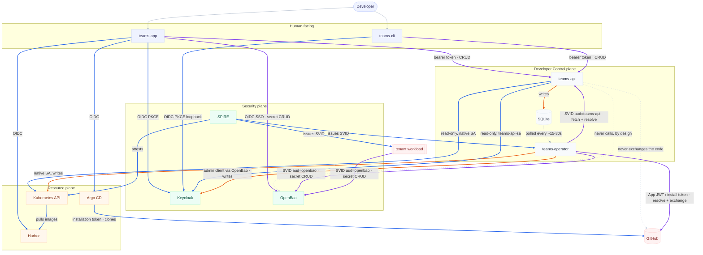

# Component communication matrix

Every documented component-to-component call in the platform: who calls whom,
over what mechanism, proving identity how, and for which specific use cases —
plus the calls that are notably **absent** (a component that could plausibly
reach another but deliberately doesn't). Compiled from `docs/authn-authz-model.md`,
`docs/keycloak-write-ownership-and-internal-auth.md`,
`docs/openbao-spiffe-access.md`, `docs/openbao-secret-organization-and-access.md`,
`docs/concepts.md`, `docs/self-service-boundaries.md`, and
`docs/self-service-repos-github-app.md`, cross-checked 2026-08-04.

Status tags used below:
- **live** — verified against the running cluster.
- **built** — implemented in code/manifests, not yet exercised against a live
  project (no live demo project as of this session — see root `CLAUDE.md`).
- **designed** — documented intent, implementation not (yet) merged.

## Legend: trust mechanisms

| Mechanism | What it means |
|---|---|
| **OIDC (human)** | Keycloak Authorization Code + PKCE; short-lived bearer access token |
| **SVID, aud=X** | SPIRE-issued JWT-SVID scoped to audience `X`; validated against SPIRE's JWKS, a separate trust root from Keycloak's |
| **native SA** | The pod's own in-cluster Kubernetes ServiceAccount token — not SPIFFE, not Keycloak |
| **admin client (secret via OpenBao)** | A Keycloak client-credentials secret, but the secret itself is fetched from OpenBao over SPIFFE, not a static k8s Secret |
| **browser-redirect** | No token exchanged directly between the two systems — the human's browser carries a signed `state` blob across the hop |
| **App JWT / installation token** | GitHub App auth: a short-lived App JWT exchanged for a ~1h installation token |

---

## 1. Human-facing edges

| Caller → Callee | Mechanism | Use cases |
|---|---|---|
| Developer → **teams-app** (browser SPA) | — | Loads the portal UI |
| Developer → **teams-cli** | — | Terminal-based project management |
| **teams-app** → **Keycloak** | OIDC (human), PKCE, in-browser (`keycloak-angular`) | Login; SPA holds the resulting token in memory |
| **teams-cli** → **Keycloak** | OIDC (human), loopback PKCE (`teams_cli.py login`) | Login from the terminal |
| **teams-app** / **teams-cli** → **teams-api** | OIDC (human) bearer token, validated against Keycloak's JWKS (`aud` deliberately *not* checked — Keycloak's default token audience is `"account"`, so sig+issuer+expiry gate access) | Every project/namespace/grant/GitHub-connection CRUD call, `/me`, `/kubeconfig`, `/priority-classes`, compliance/events/applications reads |
| Human (browser) → **Argo CD** | OIDC (human), native (not Dex) | Admin UI login; RBAC enforced via the Casbin policy block in `argocd-rbac-cm` — which **teams-operator** writes, not Argo CD itself |
| Human (browser) → **OpenBao UI** | OIDC SSO — token's `groups` claim resolves against a pre-existing identity-group alias | Human secret access; the alias only exists because **teams-operator** created it earlier (`ensure_openbao_access`) |
| Human (browser) → **Harbor** | OIDC (human) | Registry UI login |
| `kubectl` → **kube-apiserver** → **Keycloak** | OIDC (human), apiserver `--oidc-*` flags validate the ID token | Human `kubectl` access, via the kubeconfig teams-api hands out (`GET /kubeconfig` — the file itself carries no secret; the `oidc-login` exec plugin does a fresh PKCE login per use) |

## 2. teams-api's outbound calls — and the calls it deliberately never makes

| Caller → Callee | Mechanism | Use cases |
|---|---|---|
| **teams-api** → **its own SQLite DB** | direct | The *only* durable write path teams-api has — every mutating endpoint goes through `store.py` |
| **teams-api** → **Keycloak** (read-only) | admin client `teams-api-sa` (`view-realm, view-users, query-users, query-groups` — no write role) | User/group lookups for the UI's assignment picker; validating a proposed grant |
| **teams-api** → **Kubernetes API** (read-only) | native SA, read-only calls only (no `create_*`/`patch_*`/`delete_*` anywhere in teams-api) | Lists Rollouts/Deployments/Ingresses/Events for the UI (`workloads.py`, `provisioning_status.py`, `events_reader.py`, `app_compliance.py`) |
| **teams-api** → **GitHub** | *(no direct call at all)* | Constructs redirect URLs only (`/github/register-url`, `/github/install-url`, App-Manifest form target); the **browser** carries the actual round-trip to GitHub. teams-api's own code comment is explicit: *"teams-api never holds key material."* |
| **teams-api** → **OpenBao** | *(never — no OpenBao client exists in teams-api at all)* | n/a |

`/github/callback` and `/github/manifest-callback` are the two exceptions to
teams-api's normal "every route requires a bearer token" rule — GitHub's
redirect can't carry one. Both are still trust-anchored: they verify an
HMAC-signed `state` blob teams-api minted earlier at a call that *was*
gated by `authz.require_project_owner`.

## 3. teams-operator's outbound calls — "does the rest" fan-out

This is the one the diagram below leads with: once **teams-api** has written
intent to the DB, **teams-operator** is the sole actor that turns it into
every cluster consequence, on a continuous ~15–30s poll loop.

| Caller → Callee | Mechanism | Use cases |
|---|---|---|
| **teams-operator** → **teams-api** `/internal/*` | **SVID, aud=teams-api** — a *dedicated* second SVID, distinct from its OpenBao one; validated against `SPIRE_JWKS_URL`, pinning issuer + audience + the exact `OPERATOR_SPIFFE_ID`. A validly-minted Keycloak `teams-operator-sa` token is refused here (`403`, "no matching SPIRE key") — this path trusts only SPIRE's JWKS. | `GET /internal/teams` + `GET /internal/access` (desired state: projects, namespaces, owners, grants) · `GET /internal/github-connections` + `POST /internal/github-connections/resolve` (built) · `GET /internal/github-registrations` + `POST /internal/github-registrations/resolve` (built) |
| **teams-operator** → **Keycloak** (write) | Dedicated admin client `teams-operator-kc-admin`, secret delivered from OpenBao (`kv/platform/keycloak-admin`) over the operator's own SPIFFE identity — not a static k8s Secret | `reconcile_keycloak`: converges `{ns}-viewer`/`{ns}-maintainer` group membership, `project-<slug>-owner` group membership, and `project-manager` realm-role membership to match the DB, every poll cycle |
| **teams-operator** → **OpenBao** | **SVID, aud=openbao** → `teams-operator-admin` jwt role → privileged scoped token | Writes per-namespace/-project policies, jwt roles, identity-group-aliases (`ensure_openbao_access`, `ensure_openbao_project_access`); writes/reads KV data under `kv/platform/*` (Keycloak admin secret, GitHub App keys); **delete-only** on tenant KV trees (`_delete_kv_tree` — it can wipe a tenant's secrets on teardown but never routinely reads their values) |
| **teams-operator** → **Kubernetes API** | native in-cluster ServiceAccount | Creates/updates namespaces, RoleBindings, `ResourceQuota`/`LimitRange`, `NetworkPolicy`, the Harbor pull secret, the Argo CD `AppProject`, and the per-project Casbin block in `argocd-rbac-cm` |
| **teams-operator** → **GitHub API** | **App JWT / installation token** — mints a short-lived installation token from the platform (or per-project, *built*) App's private key, itself read from OpenBao | Resolves an `installation_id` to its picked repos (`/installation/repositories`); exchanges a one-time App-Manifest `code` for the App's credentials (`/app-manifests/{code}/conversions`, *built*, per-project connections) — **teams-operator is the only component that ever holds a GitHub App private key** |

## 4. Workload identity plane (SPIFFE/SPIRE)

| Caller → Callee | Mechanism | Use cases |
|---|---|---|
| **SPIRE Server** ↔ **Kubernetes API** | native SA (SPIRE's own controller) | Node/pod attestation — verifies a pod's ServiceAccount, namespace, and labels before issuing it any SVID |
| **SPIRE Agent** → tenant pod (via `spiffe-helper` sidecar) | local Workload API (unix socket, not a network call) | Fetches and auto-rotates a JWT-SVID; **teams-operator's own pod runs a dedicated two-audience config** (`operator-spiffe-helper.conf`) to get *both* an `openbao`-audience and a `teams-api`-audience SVID — a tenant pod's template stays `openbao`-only, and must never be handed a `teams-api` credential |
| Tenant workload (via `openbao-agent` sidecar) → **OpenBao** | **SVID, aud=openbao**, namespace-scoped `<namespace>` jwt role → `<namespace>-maintainer-policy` | The app container calls `127.0.0.1:8207` and never handles the token itself; access is opt-in per pod (`platform…/openbao-access: "true"` label triggers Gatekeeper mutation, which injects the sidecars) |

## 5. Supply chain & runtime admission

| Caller → Callee | Mechanism | Use cases |
|---|---|---|
| GitHub Actions (CI) → **Fulcio** / **Rekor** (Sigstore) | GitHub OIDC token → ~10 min ephemeral cert → sign → public transparency log | Keyless image signing + SBOM/vuln/quality/SLSA-provenance attestations, no `COSIGN_KEY` anywhere |
| **Gatekeeper** (admission webhook) → **Ratify** | in-cluster call at pod admission | Pulls the image's signature + attestations, checks them against Sigstore's TUF trust root and the pinned signer identity (`github.com/<repo>/.github/workflows/release.yml`) — admit/deny |
| kubelet/containerd → **Harbor** | Harbor pull secret (created per-namespace by **teams-operator**) | Image pulls for every tenant workload |
| **Argo CD** → **GitHub** | GitHub App installation token (~1h, minted from the credentials **teams-operator** materialized as a k8s `repository` Secret) | Clones private source repos to render/deploy manifests — no standing SSH deploy key anywhere |

---

## Diagram

**Edge color is the permission direction**, independent of arrow weight
(`==>` still marks the "operator does the rest" fan-out from §3, and plain
`-->` vs `-.->` still marks an ordinary call vs an indirect/absent one):

| Color | Meaning |
|---|---|
| 🔵 blue | read-only |
| 🟠 orange | write-only |
| 🟣 violet | read/write (both directions happen over that edge) |
| ⚪ gray | not a data-access edge — either structural (a human opening a client) or explicitly absent |

## Where things live

| Concern | File |
|---|---|
| teams-api auth/authz mechanics | `docs/authn-authz-model.md` |
| Keycloak write-ownership cutover, the operator's two SVIDs | `docs/keycloak-write-ownership-and-internal-auth.md` |
| SPIFFE/SPIRE → OpenBao workload path | `docs/openbao-spiffe-access.md` |
| OpenBao KV layout + access matrix | `docs/openbao-secret-organization-and-access.md` |
| GitHub App flow (single + multi-connection) | `docs/self-service-repos-github-app.md` |
| "Who writes what" one-page summary | `docs/concepts.md` |
| Enforced self-service invariants (AppProject guardrails, ownership checks) | `docs/self-service-boundaries.md` |
