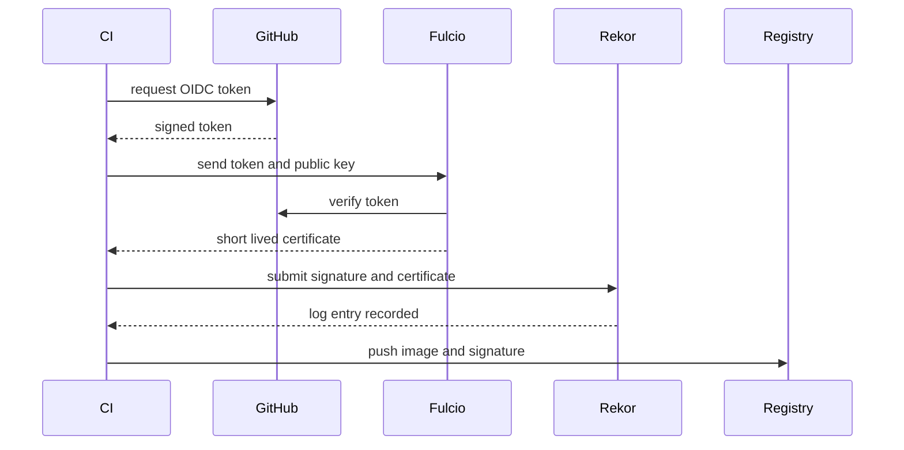
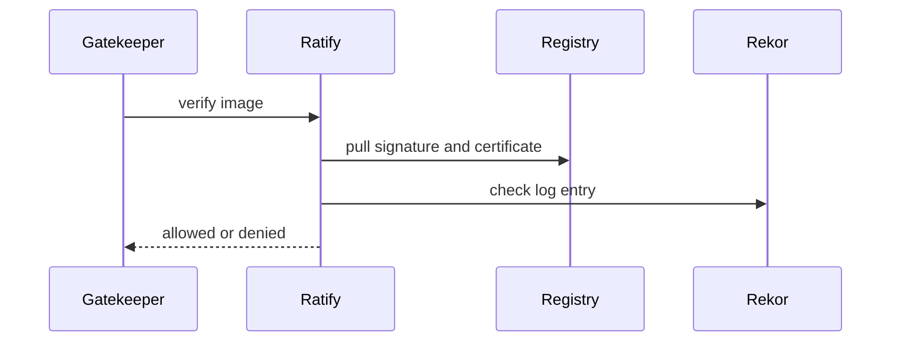

# Keyless signing — sequence diagram

## Signing

## Verification

- Fulcio is the only step that checks the GitHub token. It issues a short
  lived certificate instead of a long lived key.
- Rekor does not check GitHub. It only checks that the signature matches
  the certificate, then records the entry publicly.
- Ratify does not trust GitHub either. It checks the signature, checks the
  certificate identity against an allow list, and checks Rekor for the log
  entry.
